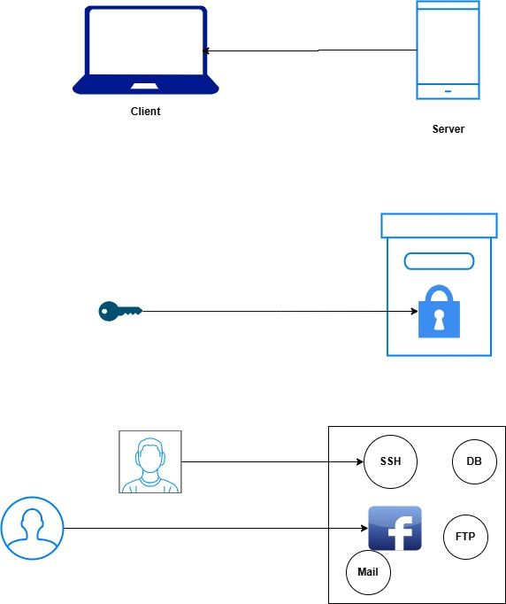

What is computer?
What is Client Server architecture?

RAM
Storage
OS
Processor

IP enable device

Server --> to host application
Port forwarding --> You can deploy application in your laptop and open it in internet

facebook.com --> facebook application in fb servers
browser --> Client software

Linux
=========

Region --> HYD, Mumbai, Singapore, US, EU
AZ --> North HYD, South HYD --> min 2 AZ --> High availability

Instance == Server == node

Firewall == Security Group

allow everyone one through firewall

inbound --> incoming traffic
outbound --> outgoing traffic

0.0.0.0/0 --> every computer in the internet

RAM
Storage
OS
Processor

devops-practice --> AMI == Amazon Machine Image
.iso --> It will create entire operating system --> C:\Windows

Redhat Enterprise Linux == Centos == Amazon Enterprise Linux == Fedora == AlmaLinux

Kernel == Brain of OS == C language
User Interface

Linus torvalds == Inventor of Linux
Mac -> Hardware locking --> you are buying both hardware and Mac OS

Servers == Unix
Laptops == IBM BIOS

Linux -> C language == Kernel
OS == Kernel + User Interface == Open Source

Linux Implementations == Distributions == Flavours
=======================
RHEL --> Commercial
IBM AIX
Ubuntu
Fedora
Solaris
Suse
Android

OpenSource and Enterprise

AWS Linux 2023 AMI
t3.micro/t2.micro

Authentication
===============
1. What you know --> Username and Password
2. What you have --> Username and token/OTP
3. What you are --> Fingerprints, Retina, Palm, etc.

PublicKey and PrivateKey

Lock and Key
Lock --> Public
Key --> Private

Server == IP(Public)

ssh-keygen -f <file-name> ==> public key and private key

pwd --> Present working directory
C:\Users\<your-username> --> Windows
/c/Users/siva --> Linux

Git bash ==> SSH Client, Git Client, Mini Linux

~ --> Home directory
/c/devops/daws-82s

ls -l --> List sub directory

ssh-rsa
ssh-ed25519
both are public keys

Enable extension

aadhar.png
jul-payslip.pdf

jul-payslip

.pub --> public key
.pem --> private key

Public IP == 184.72.71.255
AWS Linux 2023 AMI --> ec2-user and our private key

IP, Username, password, protocol, port

HTTP facebook.com/IP, Username, Password, 80

facebook.com/IO, Username, Password/PrivateKey, SSH, 22

SecureShell 22 --> it wil give full access to the server

Delhi --> HYD

f:no, apartment name, pincode

siva, 523764

ssh -i <private-key> ec2-user@IP

1. Create public and private keys
2. Import public key
3. Create firewall
4. Create Instance
5. Connect to Instance
6. Terminate when not using